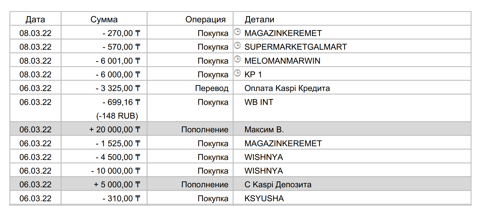

Небольшая библиотека для парсинга PDF выписки со счета kaspi.kz.
Суть библиотеки вытащить табличную чась из файла.
Бибилиотека использует \Smalot\PdfParser\Parser
https://github.com/smalot/pdfparser/
#Использование
```php
use AccountStatement\Kaspi;
...
$parsing = new Kaspi('путь до файла');
```
Получить таблицу
```php
$tbl=$parsing->getTable();
```
Возвращает массив с объектами ItemTable
#Пример 
Входной файл pdf

```php
use AccountStatement\Kaspi;
...
$parsing = new Kaspi(BASE_PATH . '/upload/Kaspi_Gold.pdf');
var_dump($parsing->getTable());
```
Результат следующий:
```
array (size=183)
0 =>
    object(AccountStatement\ItemTable)[50]
    public 'Date' => string '08.03.22' (length=8)
    public 'Sum' => float -270
    public 'Operation' => string 'Покупка' (length=14)
    public 'Details' => string 'MAGAZINKEREMET' (length=14)
1 =>
    object(AccountStatement\ItemTable)[52]
    public 'Date' => string '08.03.22' (length=8)
    public 'Sum' => float -570
    public 'Operation' => string 'Покупка' (length=14)
    public 'Details' => string 'SUPERMARKETGALMART' (length=18)
2 =>
    object(AccountStatement\ItemTable)[53]
    public 'Date' => string '08.03.22' (length=8)
    public 'Sum' => float -6001
    public 'Operation' => string 'Покупка' (length=14)
    public 'Details' => string 'MELOMANMARWIN' (length=13)
3 =>
    object(AccountStatement\ItemTable)[164]
    public 'Date' => string '08.03.22' (length=8)
    public 'Sum' => float -6000
    public 'Operation' => string 'Покупка' (length=14)
    public 'Details' => string 'KP 1' (length=4)
4 =>
    object(AccountStatement\ItemTable)[209]
    public 'Date' => string '06.03.22' (length=8)
    public 'Sum' => float -3325
    public 'Operation' => string 'Перевод' (length=14)
    public 'Details' => string 'Оплата Kaspi Кредита' (length=33)
5 =>
    object(AccountStatement\ItemTable)[163]
    public 'Date' => string '06.03.22' (length=8)
    public 'Sum' => float -699.16
    public 'Operation' => string 'Покупка' (length=14)
    public 'Details' => string 'WB INT' (length=6)`
...
```

[dsfsdf]: https://github.com/smalot/pdfparser/